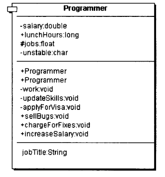
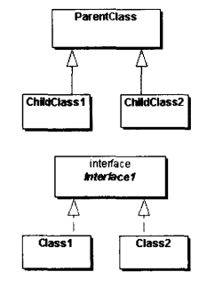
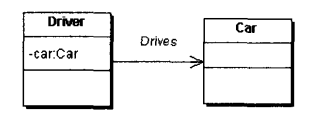
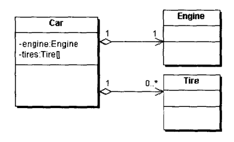
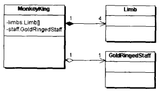
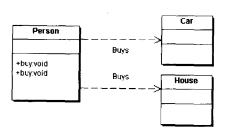
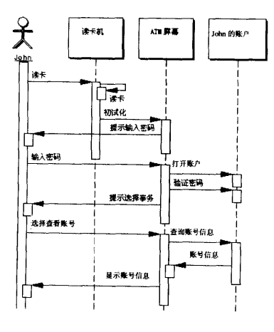
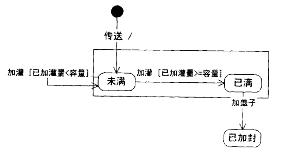

## 第一部分 UML和模式介绍

### 第一章 模式简史和形而上学

### 第二章 统一建模语言UML简介

用例图，类图，序列图最为有用。

#### 类图

##### 描述类的类图

  

| 层级   | 层名   | 描述                                       |
| ---- | ---- | ---------------------------------------- |
| 1    | 类名   | 正体字：可实例化类；斜体字：不可实例化类（抽象类，接口）             |
| 2    | 属性   | +：public；-：private；#：protected； ：（default） |
| 3    | 方法   | （同上），静态方法以下划线结尾                          |
| 4    | 性质   | 性质是由一个内部变量及它的赋值函数，取值函数构成                 |
| 5    | 内部类  |                                          |

##### 类图中的关系

**一般化关系**(Generalization) -> "Is-A"

  
从子类指向父类(实线，空三角箭头)，实现接口的类指向被实现接口的接口(虚线，空三角箭头)，与继承或实现的方向相反。
一般化关系在Java语言中可以直接译为`extends`和`implements`。

**关联关系**(Association) -> "Has-A"

  
类与类之间的联接，它使一个类知道另一个类的属性和方法。关联关系可以是单向的（指向被关联类，三叉箭头，两头可以有基数），也可以是双向的（不鼓励，可以取消箭头）。

在Java语言中，关联关系是用实例变量来实现的。

**聚合关系**(Aggregation)

  
聚合关系是更为强烈的关联关系，表示整体（空心菱形箭尾）和部分（同关联关系箭头）之间的关系。如汽车类和轮胎类，

引擎类及其他零件类便是聚合关系。

**合成关系**(Composition)

  
合成关系是比聚合关系更强的关联关系，它要求普通聚合关系中代表整体的对象（箭尾是实心的菱形）负责代表部分对象的生命周期，合成关系式不能共享的。

上图中的MonkeyKing与GoldRingedStaff是聚合关系，与他的四肢（limbs）是合成关系，因为他的四肢完全由美猴王负责，并且不能共享。

**依赖关系**(Dependency) -> "Use A"

  
依赖也是类与类之间的连接，依赖总是单向的。依赖关系表示一个类依赖于另一个类的定义。

一般而言，依赖关系在Java语言中体现为局部变量，方法的参量，以及对静态方法的调用。

#### 时序图

在一个时序图中，垂直的叫做对象的生命线，表示一个对象存在的时间。每一个箭头都是一个调用，这个箭头从调用者对象连接到接收者对象的生命线上的激活条上。每一个激活条表示对象调用所持续的时间。

#### 状态图

状态图的基本想法是定义一个具有有限个内部状态的机器，因此状态图有称作有限状态机。对象被外界的时间激发，从而从一个状态转换到另一个状态。

