## 第三部分 创建模式

类的实例化过程抽象化。分为以下两种：

- 类的创建模式
- 对象的创建模式


### 第十二章 简单工厂模式

是类的创建模式，又叫做静态工厂方法模式。简单工厂模式是由一个工厂对象决定创建出哪一个产品类的实例。


#### 工厂模式的几种形态

- 简单工厂模式
- 工厂方法模式
- 抽象工厂模式

#### 简单工厂模式的结构

**一般性结构**

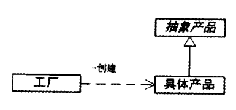

**角色与结构**

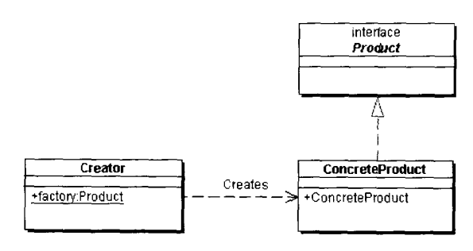

- 工厂类（Creator）角色：工厂方法的核心，含有与应用紧密相关的商业逻辑。工厂类在客户端的直接调用下创建对象，它往往由一个具体Java类实现。
- 抽象产品（Product）角色：工厂方法所创建的对象的父类，或共同拥有的接口。用一个Java接口或Java抽象类实现。
- 具体产品（ConcreteProduct）角色：工厂类所创建的实例，由一个具体的Java类实现。

```java
public class Creator {
	// 静态工厂方法
	public static Product factory() {
		return new ConcreteProduct();
	}
}

public interface Product {}

public class ConcreteProduct implements Product{}
```


#### 简单工厂模式的实现

1. 多层次的产品结构：采用同一个工厂类
2. 使用Java接口或抽象类
3. 多个工厂方法，如DateFormat
4. 抽象角色的省略：仅有一个具体产品角色
5. 工厂角色与抽象产品角色的合并
6. 三个角色全部合并
7. 采用对象循环使用和登记式的工厂方法：与单例模式和多例模式的影响


#### 工厂模式其他模式间的关系

- 单例模式
- 多例模式
- 备忘录模式
- MVC模式


#### 简单工厂模式的优缺点

**优点**

工厂负责创建对象，客户端免除直接创建对象的责任，而仅仅是**消费**产品。简单工厂模式通过这种方法实现了对责任的分割。

**缺点**

当有复杂的多层次等级结构时，工厂类只有它自己。以不变应万变，扩建性差，是这个模式的缺点。
由于简单工厂模式采用静态方法作为工厂方法，而静态方法无法继承，因此工厂方法无法形成基于继承的等级结构，这一缺点会在工厂方法模式中克服。

**“开-闭”原则**

简单工厂模式只在有限程度上支持“开-闭”原则。


#### 简单工厂模式在Java中的应用

**DateFormat**

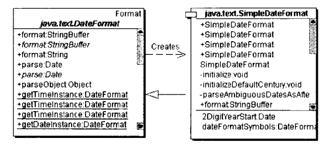

**SAX2库中的XMLReaderFactory与简单工厂模式**

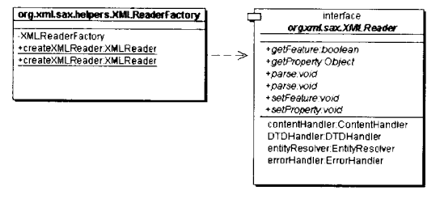


### 第十三章 工厂方法模式

对简单工厂模式的进一步抽象和推广。核心工厂类变为抽象类，产品的创建交给其子类，核心类不接触哪一个产品类实现的细节。

**结构图**

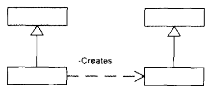

**平行等级结构**

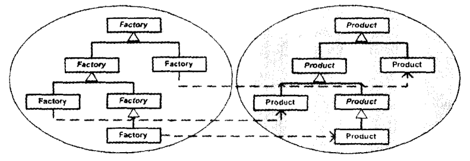

#### 工厂方法模式的结构

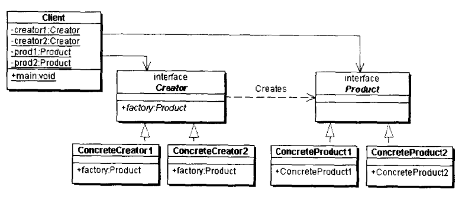

- 抽象工厂（Creator）角色：工厂方法模式的核心，与应用程序无关。使用Java接口或抽象类实现。
- 具体工厂（Concrete Creator）角色：具体的Java类，实现抽象工厂，含有与应用密切关系的逻辑。
- 抽象产品（Product）角色
- 具体产品对象（Concrete Product）角色

对于增加新产品而言，这个系统完全支持“开-闭”原则。


#### 工厂方法模式的实现

1. 使用Java接口或者Java抽象类
2. 使用多个工厂方法
3. 产品的循环使用：享元模式就是采用了循环工厂模式
4. 多态性的丧失和功能的退化


#### Java中工厂方法模式的例子

**Collection与Iterator**

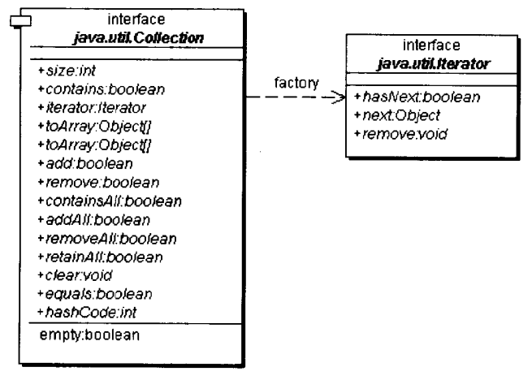

一个具体的Collection对象就会通过iterator()方法返回一个具体的Iterator类。可以看出，这个iterator()就是一个工厂方法。

类似的还有具体的List对象的listIterator()方法返回ListIterator对象。


**URL与URLConnection的使用**

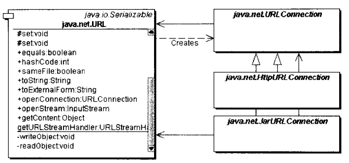

URL对象使用了工厂方法模式，以一个工厂方法openConnection()返回一个URLConnection类型的对象。由于URLConnection是一个抽象类，返还的必然是其具体子类的实例。


#### 工厂方法模式与其他模式的关系

1. 模板方法模式
2. MVC模式
3. 享元模式
4. 备忘录模式


#### 其他的例子

1. COM技术架构中的工厂方法模式
2. EJB技术架构中的工厂方法模式
3. JMS技术架构中的工厂方法模式


### 第十四章 抽象工厂模式

抽象工厂模式是所有形态工厂模式中最为抽象和一般性的一种形态，简略类图如下所示：

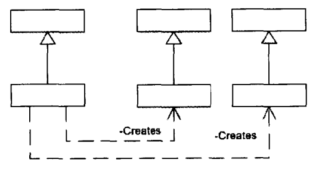

抽象工厂模式可以向客户端提供一个借口，使得客户端在不必指定产品的具体类型的情况下，创建多个产品族的对象。
“抽象”来自“抽象产品角色”，而“抽象工厂”就是抽象产品角色的工厂。


**产品族**

位于不同的等级结构中，功能相关联的产品组成的家族。

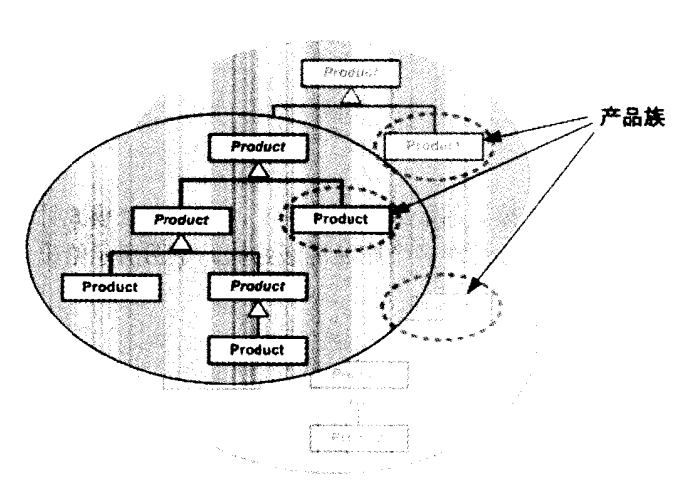

**引入抽象工厂模式**

一个工厂等级结构可以创造出分属于不同等级结构的一个产品族中的所有对象，显然，抽象工厂模式比工厂方法模式更有效率。

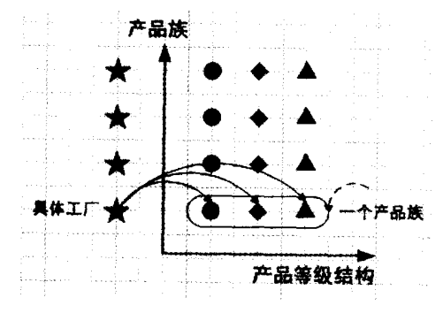

#### 抽象工厂模式的系统类图

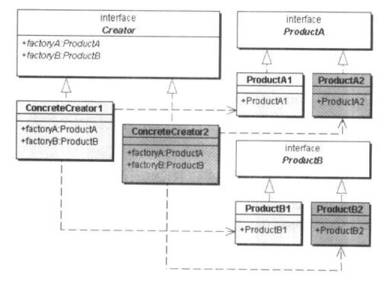

- 抽象工厂（AbstractFactory）角色：工厂方法模式的核心，与系统的商业逻辑无关。通常使用Java接口或抽象类实现，所有的具体工厂类都需要继承这个类。
- 具体工厂类（ConcreteFactory）角色：直接在客户端的调用下创建产品的实例，含有选择合适产品的逻辑，应该和商业系统紧密相关，通常使用具体的Java类来实现这个角色。
- 抽象产品（AbstractProduct）角色
- 具体产品（ConcreteProduct）角色


#### 在什么情形下使用抽象工厂模式

- 一个系统不应当依赖于产品类如何被创建、组合和表达的细节
- 这个系统的产品有多于一个产品族，而系统只消费某一个产品族
- 同属于同一个产品族的产品是一起使用的
- 系统提供一个产品类的库，所有的产品以同样的接口出现，从而使客户端不依赖于实现


#### “开-闭”原则

- 增加新的产品族：支持
- 增加新的产品等级结构：不支持

综合起来，抽象工厂模式是以一种倾斜的方式支持增加新的产品，它为新产品族的增加提供了方便，而不能为新的产品等级结构的增加提供方便。


#### 相关的模式与模式的实现

具体工厂类与单例模式

工厂的工厂

通过工厂方法模式或原始模型模式实现

桥梁模式


### 第十五章 单例模式

单例模式确保一个类只有一个实例，并且自行实例化并向整个系统提供这个实例。

**资源管理**

一些资源管理器常常被设计成单例模式。


#### 单例模式的结构

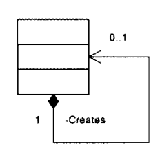

**饿汉式单例类** (类加载时实例化)

```java
public class EagerSingleton {
	private static final EagerSingleton instance = new EagerSingleton();

	private EagerSingleton() {}

	public static EagerSingleton getInstance() { return instance;}
}
```

**懒汉式单例类**（第一次使用时实例化）

```java
public class LazySingleton {
	private volatile static LazySingleton instance = null;

	private LazySingleton() {}

	public static LazySingleton getInstance() {
		if (instance == null) {
			synchronized(LazySingleton.class) {
				if (instance == null) {
					instance = new LazySingleton();
				}
			}
		}
		return instance;
	}
}
```


#### Java语言中的单例模式

1. Java的Runtime对象
2. Introspector类
3. java.awt.Toolkit类
4. 模板方法模式
5. javax.swing.TimerQueue类


#### 相关模式

1. 多例模式
2. 简单工厂模式


### 第十六章 专题：单例模式与MX记录


### 第十七章 多例模式与多语言支持

多例模式的多例类可以拥有多个实例，而且多例类必须自己创建、管理自己的实例，并向外界提供自己的实例。

**多例模式结构图**

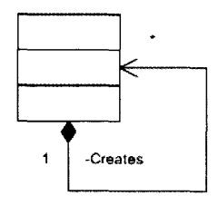

**有上限的多例**

一个有上限的多例可以使用静态变量存储所有实例，特别是在实例数目不多的时候，可以用一个个静态变量存储一个个实例。

**无上限的多例**


**多语言项目设计**


### 第十八章 专题：序列键生成器与单例及多例模式


### 第十九章 建造模式

将一个产品的内部表象与产品的生成过程分割开来，从而使一个建造过程生成不同内部表象的产品对象。


#### 建造模式的结构

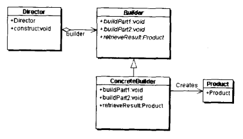

- 抽象建造者（Builder）角色：给出一个抽象接口，以规范产品对象的各个组成成分构造。
- 具体建造者（Concrete Builder）角色：与应用程序紧密相关的一些类，它在程序的调用下创建产品的实例。
- 导演者（Director）角色：调用具体建造者角色以创建产品对象。
- 产品（Product）角色：建造中的负责对象。


#### Java Mail中的建造模式


#### 什么情况下使用建造模式

1. 需要生成的产品对象有复杂的内部结构。
2. 需要生成的产品对象的属性相互依赖。
3. 在创建对象的过程中会使用到系统的其他一些对象，这些对象在产品对象的创建过程中不容易得到。


### 第二十章 原始模型模式

通过给出一个原型对象来指明要创建的对象的类型，然后用复制这个原型对象的办法创造出更多不同类型的对象。

Java语言的构件模型直接支持原始模型模式，所有的JavaBean都继承自java.lang.Object，而这个类提供一个clone()方法，可以将一个JavaBean对象复制一份。


#### 原型模式的结构

**简单形式的原型模式**

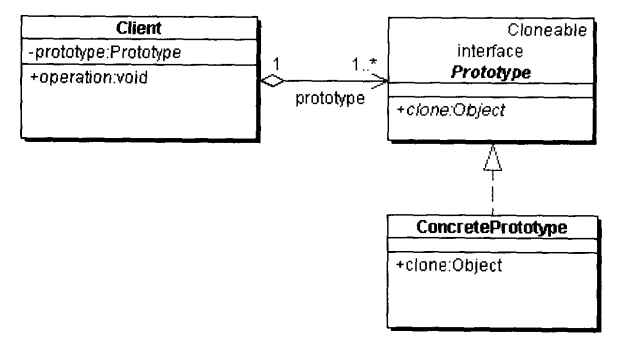

- 客户（Client）角色：客户类提出创建对象的请求。
- 抽象原型（Prototype）角色：给出具体原型类的接口，由Java接口或抽象类实现。
- 具体原型（Concrete Prototype）角色：被复制的角色。


**登记形式的原型模式**

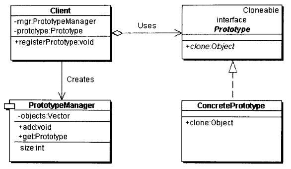

- 客户（Client）角色：向管理员提出创建对象的请求。
- 抽象原型（Prototype）角色
- 具体原型（Concrete Prototype）角色
- 原型管理器（Prototype Manager）角色：创建具体原型类对象，并记录每一个被创建的对象


#### 模式的实现：深复制和浅复制

**浅复制**

被复制对象的所有变量都含有与原来的对象相同的值，而所有的对其他对象的引用都仍指向原来的对象。例如：clone()方法。

**深复制**

被复制对象的所有的变量都含有都含有与原来对象相同的值，除去那些引用其他对象的变量。需要实现java.io.Serializable接口。

**利用串行化来做深复制**

把对象写到流里的过程是串行化（Serilization）过程，而把对象从流中读出来是并行化（Deserialization）过程。


#### 原型模式的优点和缺点

**优点**

1. 允许动态地增加或减少产品类。
2. 简化创建结构。
3. 具有给一个软件动态增加新功能的能力。
4. 产品类不需要非得事先确定产品结构，因为原型模式适用于任何等级结构。

**缺点**

需要给每一个类配备一个克隆方法，配备克隆方法需要全局考虑，特别是一个类的引用不支持串行化的间接对象，或者引用还有循环结构的时候。


### 第二十一章 专题：JavaBean的“冷藏”和“解冻”


#### 什么是冷藏和解冻

**Java串行化功能** 

将一个完整的对象写到一个byte流中

**串行化的威力**

一个Java程序不需要直接处理存储在硬盘上的原始数据，很容易将一个Java对象和二进制流之间转换。
通过实现Serializable或Externalizable接口。

**Serializable接口是标识接口**


#### 什么可以冷藏

**什么可以串行化**

- java.awt.Component
- java.lang.Throwable

**什么样的类不可以串行化**

- 一个类与本地代码有密切关系：java.util.zip.Deflater
- 对象的内部状态依赖于java虚拟机或运行环境，从而在每一次运行时这个状态都有可能不同。如java.lang.Thread，java.io.InputStream，java.io.FileDescriptor等
- 串行化可能带来潜在的隐患。如java.lang.SecurityManager以及java.security.MessageDigest
- 一个类仅仅是一些静态方法的存放地，并没有任何的内部状态。如java.beans.Beans和java.lang.Math
