## 第四部分 结构模式

描述如何将类或者对象结合在一起形成更大的结构，分为：

- 类的结构模式：使用继承把类、接口等组合在一起。
- 对象的结构模式：怎样把不同类型的对象组合在一起，以实现新的功能的方法。

### 第二十二章 适配器模式

把一个类的接口转换成客户端所期待的一种接口，从而使因原本不匹配的两个类可以一起工作。

#### 类的适配器模式的结构

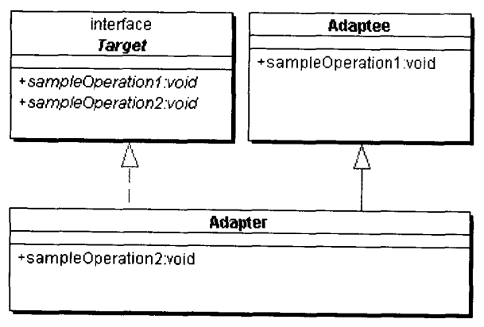

- 目标（Target）角色：所期待得到的接口。
- 源（Adaptee）角色：现有需要适配的接口。
- 适配器（Adapter）角色：本模式的核心，把源接口转化为目的接口。通过具体类实现。

#### 对象的适配器模式的结构

- 目标（Target）角色
- 源（Adaptee）角色
- 适配器（Adapter）角色：Adapter和Adaptee是委派关系，这决定了这个模式的对象的。

#### 在什么情况下使用适配器模式

1. 系统需要此类，但此类的接口不符合系统的需要。
2. 想要建立一个可以重复使用的类，用于一些彼此之间没有太大关系的类，包括将来将引入的一些类。
3. 需要改变已有子类的接口（对于对象的适配器模式而言）

#### 适配器模式在架构层次上的应用

**WINE**

**MKS Toolkit**

**JDBC驱动软件与适配器模式**

#### 适配器模式与相关模式

与桥梁模式、与装饰模式、与缺省适配模式的关系

### 第二十三章 缺省适配模式

为一个接口提供缺省实现，这样的子类型可以从这个缺省进行扩展，而不必从原有的接口扩展。适配器模式的平庸化使所考察的类不必实现不需要的那部分接口。缺省适配类应当是抽象类，不可实例化，实例化了也没用什么作用。

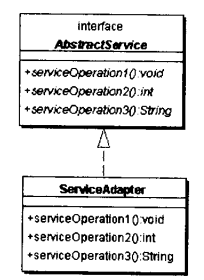

#### WindowAdapter是缺省适配模式

#### J2SE中的缺省适配模式

### 第二十四章 专题：XMLProperties与适配器模式

### 第二十五章 合成模式

合成模式将对象组织到树结构中，可以用来描述整体与部分的关系。合成模式可以使客户端将单纯元素和复合元素同等看待。

**文件系统**

一个文件系统就是一个典型的合成模式系统，显然，可以把文件和目录当成同一种对象同等对待和处理。

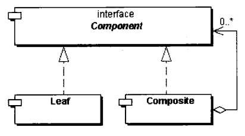

- 抽象构件（Component）角色：一个抽象角色，给参加组合的对象规定一个接口（公有接口、默认行为）。
- 树叶构件（Leaf）角色：参加组合的树叶对象，一个树叶没有下级子对象，定义参与组合对象的原始行为。
- 树枝构件（Composite）角色：参加组合的所有子对象的对象，并给出树枝构件对象行为。

**透明式**

在Component中声明用来管理子类对象的方法，包括add()、remove()和getChild()方法。所有的构件都有同样的接口，但使用树叶对象的管理子类方法会在运行时报错。

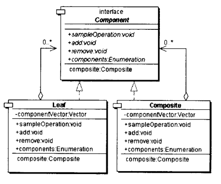

**安全式**

在Composite中声明用来管理子类对象的方法，树叶对象使用这些方法会在编译时报错，缺点是不够透明。

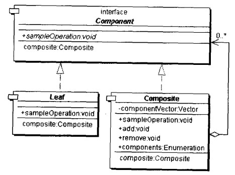

#### AWT库的例子

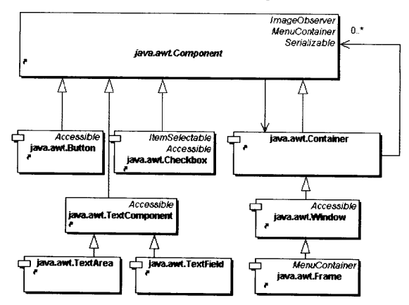

在Container中可以含有其他的Component对象。

#### 合成模式和其他模式的关系

命令模式、装饰模式、迭代模式、责任链模式、享元模式

### 第二十六章 装饰模式

以对客户端透明的方式扩展对象的功能，是继承关系的一个替代方案。

#### 装饰模式的结构

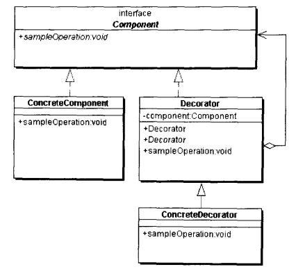

- 抽象构件（Component）角色：给出一个抽象接口，以规范准备接收附加责任的对象。
- 具体构件（ConcreteComponent）角色：定义一个将要接收附加责任的类。
- 装饰（Decorator）角色：持有一个构件角色的实例，并实现构件角色的接口。
- 具体装饰角色（ConcreteDecorator）角色：负责给构件对象贴上附加的责任。

#### 使用情形

1. 需要扩展一个类的功能，或给一个类增加附加责任。
2. 需要动态地给一个对象增加功能，这些功能可以再动态地撤销。
3. 需要增加由一些基本功能排列组合而产生的非常大量的功能，使用继承已变得不现实。

#### 优点和缺点

**优点**

1. 同是拓展对象的功能，可以提供比继承模式更强的灵活性
2. 通过使用不同的具体装饰类以及这些装饰类的排列组合，设计师可以创造出很多不同的组合
3. 比继承更加灵活机动的特性，也同时意味着比继承更容易出错

**缺点**

产生比继承关系更多的对象，意味着排错变得更为困难。

#### 与适配器模式

装饰模式和适配器模式都是包装（Wrapper）模式。它们之间的区别是，适配器模式把一个API转换成另一个API，而装饰器模式则是保持被包装的对象的API。用Java的术语来讲，适配器和被适配的类实现的是不同的接口和抽象类，而装饰模式和被装饰类是是面向的是相同的接口或抽象类。

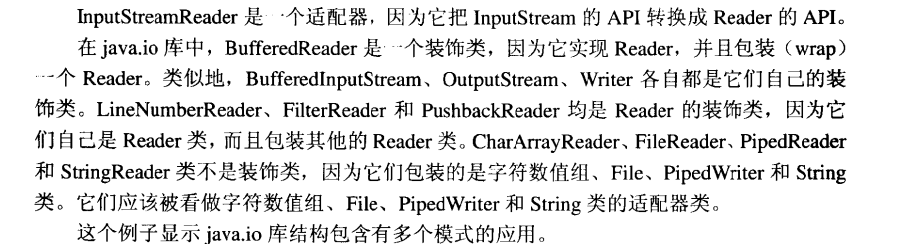

### 第二十七章 设计模式在Java I/O库中的应用

### 第二十八章 代理模式

给某一个对象提供一个代理对象，并由代理对象控制原对象的引用。

#### 代理模式的种类

1. 远程代理：为一个位于不同地址空间的对象提供一个局域代表对象。
2. 虚拟代理：根据需要创建一个资源消耗较大的对象，使得此对象只有在需要时才会被真正创建。
3. Copy-On-Write代理：虚拟代理的一种。把复制拖延到客户端需要时，再真正的采取行动。
4. 保护代理：控制一个对象的访问，如果需要，可以给用户不同等级的权限。
5. Cache代理：为某一目标提供一个临时的存储空间，以便使多个客户端可以共享这个结果。
6. 防火墙代理：保护目标，不让恶意用户接近。
7. 同步化代理：使几个用户可以同时使用一个对象，而不产生冲突。
8. 智能引用代理：当一个对象被引用时，提供一个额外的操作，如记录对象的引用次数等。

远程代理的例子 Achillies

Windows快捷方式：代理的例子

#### 代理模式的结构

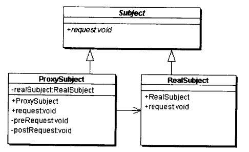

- 抽象主题角色：声明真实主题和代理主题的共同接口，这样一来任何可以使用真实主题的地方都可以使用代理主题。
- 代理主题角色：代理主题角色内部含有对真实主题的引用，从而可以在任何时候操作真实主题对象。
- 真实主题角色：定义了代理角色所代表的真实对象。

### 第二十九章 专题：智能引用代理

### 第三十章 专题：虚拟代理的例子

### 第三十一章 享元模式

以共享的方式高效地支持大量细粒度的对象。

**享元模式的应用**

在Java语言中，String类型就使用了享元模式。String对象是不变对象。如果需要改变一个字符串的值，就必须新建一个String对象。在JVM内部，String对象都是共享的，如果一个系统中有两个String对象所包含的字符串引用的话，JVM实际上只创建一个String对象提供给两个引用，从而实现String对象的共享。String的intern()方法给出这个字符串在共享池中的惟一实例。

#### 单纯享元模式的结构

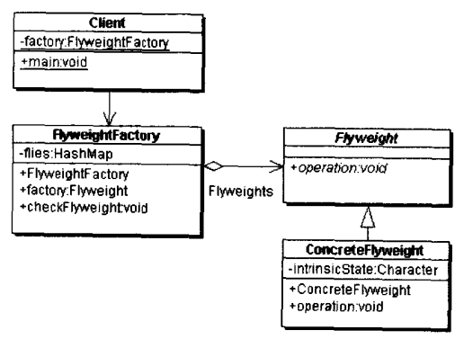

- 抽象享元（Flyweight）角色：具体享元类的超类，为这些类提供公共接口。那些外蕴状态（External State）的操作可以通过调用商业方法以参数形式传入。
- 具体享元（ConcreteFlyweight）角色：实现抽象享元角色所规定的接口，如果有内蕴状态（Internal State）的话，为内蕴状态提供存储空间。享元的内蕴状态必须与对象所处的周围环境无关，从而使得内蕴状态可以在系统中共享。
- 享元工厂（FlyweightFactory）角色：负责创建和管理享元角色，必须保证享元对象可以被系统适当地共享。
- 客户端（Client）角色：本角色需要维护一个对所有享元对象的引用。本角色要自行存储所有享元对象的外蕴状态。

#### 复合享元模式结构

将单纯的享元通过合成模式加以复合，形成复合享元对象。这样的复合享元对象不能分享，但是它们可以分解成单纯的享元对象，后者是可以共享的。

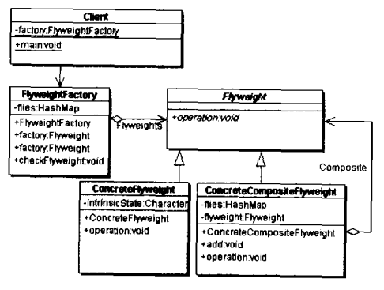

- 抽象享元（Flyweight）角色
- 具体享元（ConcreteFlyweight）角色
- 复合享元（ConcreteCompositeFlyweight）角色：复合享元对象是不可共享的，但是可以分解成多个共享对象的组合，故也称为不可共享的享元对象。
- 享元工厂（FlyweightFactory）角色
- 客户端（Client）角色

#### 模式的实现

使用不变模式实现享元角色

使用备忘录模式实现享元工厂角色

使用单例模式实现享元工厂角色

#### 享元模式使用的情形

1. 一个系统中有大量的对象
2. 这些对象需要消耗大量的内存
3. 这些对象的状态大部分需要外部化
4. 这些对象可以按照内蕴状态分成很多的组，把外蕴状态从对象中剔除时，每一个组都可以仅用一个对象代替
5. 软件系统不依赖于这些对象的身份，换言之，这些对象是不可分辨的

#### 享元对象的优点和缺点

**优点** ：大幅度降低内存中对象的数量

**缺点**

1. 系统更为复杂，为了使对象可以共享，需要将一些对象状态外部化，这使程序的逻辑复杂化。
2. 享元模式使享元状态外部化，而读取外部的状态使得运行时间稍稍变长。

#### 与其他模式的关系

单例模式、享元工厂和工厂方法模式、享元工厂与单例模式、代理模式、备忘录模式、状态模式、策略模式、合成模式、合成模式

### 第三十二章 门面模式

外部与一个子系统的通信必须通过一个统一的门面对象进行。

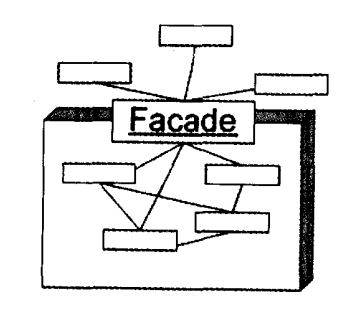

#### 门面模式的结构

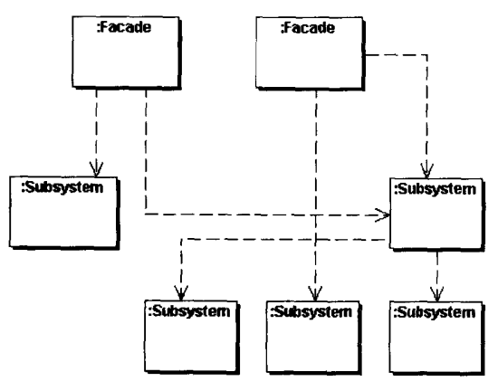

- 门面（Facade）角色：客户端调用这个角色的方法，此角色知晓相关子系统的功能和责任，可以将客户端的请求委派到相应的子系统中。
- 子系统（Subsystem）角色：可以有一个或多个子系统，每一个子系统不是一个单独的类，而是一个类的集合。每一个系统都可以被客户端直接调用，或者被门面直接调用。

#### 什么情况下使用门面模式

1. 为一个复杂子系统提供一个简单的接口
2. 子系统的独立性
3. 层次化结构

### 第三十三章 桥梁（Birdge）模式

将抽象化和实现化解耦，使得两者可以独立地变化。

#### 桥梁模式的结构

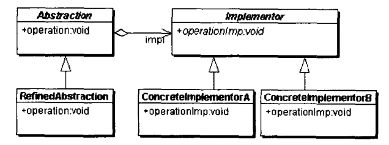

- 抽象化（Abstraction）角色：抽象化给出的定义，并保存一个对实现抽象化的引用。
- 修正抽象化（Refined Abstraction）角色：扩展抽象化角色，改变和修正父类对抽象化的定义。
- 实现化（Implementor）角色：给出实现化角色的接口，但不给出具体的实现。这个接口不一定和抽象化角色的接口定义相同。
- 具体实现化（Concrete Implementor）角色：这个角色给出实现化接口的具体实现。

#### Java语言中的应用

- AWT的Peer架构
- JDBC驱动器

#### 与其他模式的关系

适配器模式、策略模式、装饰模式、状态模式、抽象工厂模式