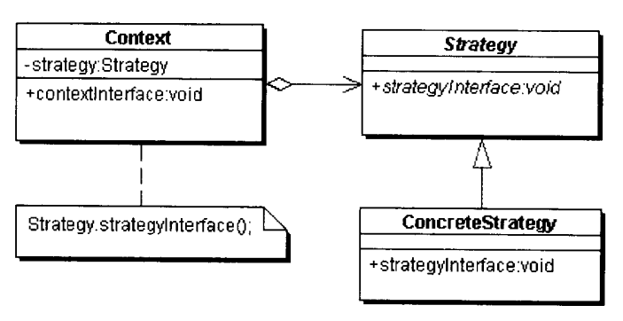
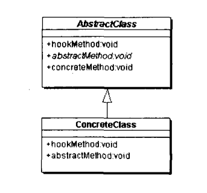

## 第五部分 行为模式

对在不同的对象之间划分责任和算法的抽象化。行为模式不仅仅是关于类和对象的，而且是关于它们之间的相互作用的。

- 类的行为模式：使用继承关系在几个类之间分配行为
- 对象的行为模式：使用对象的聚合类分配行为

### 第三十四章 不变模式

一个对象的状态在对象被创建之后就不再变化。

#### 不变模式的结构和实现

**弱不变模式**

条件：

1. 所考虑的对象没有任何方法会修改对象的状态。
2. 所有的属性都应当是私有的。
3. 防止外界对象修改这个对象引用到的可变对象。

弱点：

1. 一个弱不变对象的子对象可以是可变对象。
2. 这个可变的子对象可能可以修改父对象的状态。

**强不变对象**

条件：

1. 所考虑的类所有的方法都应当时final
2. 这个类本身就是final的

**“只读”和“不变”的区别**

当一个变量是“只读”时，变量的值不能直接改变，但是可以再其他变量发生改变的时候发生改变。例如，一个人的出生年月日时“不变”属性，而一个人的年龄是“只读”属性。

#### 不变模式在Java语言中的应用

- String类
- 基本类型包装类

#### 不变模式的优缺点

优点：不变的对象更容易维护；并且一个不变的对象自动就是线程安全的，可以省掉处理同步化的开销。

缺点：在需要频繁修改不变对象的环境里，会有大量的不变对象作为中间结果被创建，再被Java语言的垃圾回收处理器收集走，这是一种资源的浪费。

#### 与享元模式的关系

享元模式以共享的方式支持大量的实例。享元模式中的享元对象可以是不变对象，实际上，大多数的享元对象时不变对象。

### 第三十五章 策略模式

针对一组算法，将每一个算法封装到具有共同接口的独立的类中，从而使得它们可以在不影响到客户端的情况下可以相互替换。

#### 策略模式的结构

  

- 环境（Context）角色：持有一个Strategy类的引用。
- 抽象策略（Strategy）角色：给出所有具体策略类所需的接口。
- 具体策略（ConcreteStrategy）角色：包装了相关的算法或行为。

#### Java语言内部的例子

- AWT中的LayoutManager
- Swing中的Border

#### 什么情况下应当使用策略模式

1. 在一个系统中有许多类，他们之间的区别仅在与它们的行为。
2. 一个系统需要动态地在几种算法中选择一种。
3. 一个系统的算法使用的数据不可以让客户知道。
4. 一个对象有很多行为，如果不用恰当的模式，这些行为只好使用多重条件选择语句来实现。

#### 策略模式的优点和缺点

**优点**  

1. 提供了管理相关算法族的办法。
2. 提供了可以替换继承关系的办法。
3. 可以避免多条转移语句。

**缺点**

1. 客户端必须知道所有的策略类。
2. 策略模式会造成很多的策略类。

#### 与其他模式的关系

建造模式、适配器模式、享元模式、模板方法、MVC模式、装饰模式

### 第三十六章 模板方法模式

准备一个抽象类，将部分逻辑以具体方法以及具体构造子的形式实现，然后声明一些抽象方法来迫使子类实现剩余的逻辑。

#### 模板方法的结构

  

- 抽象模板角色：
  - 定义了一个或多个抽象操作，以便让子类实现。这些操作叫做基本操作，他们是一个顶级逻辑的组成步骤。
  - 定义并实现了一个模板方法。这个模板方法一般是一个具体方法，它给出了一个顶级的逻辑的骨架，而逻辑的组成步骤在相应的抽象操作中，推迟到子类实现。
- 具体模板角色：
  - 实现父类所定义的一个或多个抽象方法，他们是一个顶级逻辑的组成步骤。
  - 每一个抽象模板角色都可以有任意多个具体模板角色与之对应，而每一个具体模板角色都可以给出这些抽象方法的不同实现，从而导致顶级逻辑的实现各不相同。

#### 好莱坞原则

在好莱坞工作的演艺界人士都了解，在把简历递交给好莱坞的娱乐公司以后，所能做的事就是等待。这些公司会告诉他们“不要给我打电话，我们会给你打”。这便是所谓的“好莱坞原则”。好莱坞原则的关键之处是娱乐公司对娱乐项目的完全控制，这也体现了模板方法的关键：子类可以置换掉父类的可变部分，但是子类却不可以改表模板方法所代表的顶级逻辑。

#### Java语言中使用过的模板方法模式

- HttpServlet技术
- AbstractTableModel类
- AbstractListModel类

#### 模板方法模式中方法

**模板方法**  

一个模板方法是定义在抽象类中的，由子类不加修改地完全继承下来的，把基本方法组合在一起形成一个总算法或一个总行为的方法。

一个类中可以有任意多个模板方法，每个模板方法都可以调用任意多个具体方法。

**基本方法**  

- 抽象方法：一个抽象方法由抽象类声明，具体子类实现。Java中使用`abstract`标示出来。
- 具体方法：一个具体方法由抽象类声明并实现，而子类并不实现或置换。
- 钩子方法：一个钩子方法有抽象类声明并实现，而子类会加以扩展。通常抽象给出一个空实现，作为方法的默认实现。命名应当以 do 开始。

