## 第五部分 行为模式

对在不同的对象之间划分责任和算法的抽象化。行为模式不仅仅是关于类和对象的，而且是关于它们之间的相互作用的。

- 类的行为模式：使用继承关系在几个类之间分配行为
- 对象的行为模式：使用对象的聚合类分配行为

### 第三十四章 不变模式

一个对象的状态在对象被创建之后就不再变化。

#### 不变模式的结构和实现

**弱不变模式**

条件：

1. 所考虑的对象没有任何方法会修改对象的状态。
2. 所有的属性都应当是私有的。
3. 防止外界对象修改这个对象引用到的可变对象。

弱点：

1. 一个弱不变对象的子对象可以是可变对象。
2. 这个可变的子对象可能可以修改父对象的状态。

**强不变对象**

条件：

1. 所考虑的类所有的方法都应当时final
2. 这个类本身就是final的

**“只读”和“不变”的区别**

当一个变量是“只读”时，变量的值不能直接改变，但是可以再其他变量发生改变的时候发生改变。例如，一个人的出生年月日时“不变”属性，而一个人的年龄是“只读”属性。

#### 不变模式在Java语言中的应用

- String类
- 基本类型包装类

#### 不变模式的优缺点

优点：不变的对象更容易维护；并且一个不变的对象自动就是线程安全的，可以省掉处理同步化的开销。

缺点：在需要频繁修改不变对象的环境里，会有大量的不变对象作为中间结果被创建，再被Java语言的垃圾回收处理器收集走，这是一种资源的浪费。

#### 与享元模式的关系

享元模式以共享的方式支持大量的实例。享元模式中的享元对象可以是不变对象，实际上，大多数的享元对象时不变对象。

### 第三十五章 策略模式

针对一组算法，将每一个算法封装到具有共同接口的独立的类中，从而使得它们可以在不影响到客户端的情况下可以相互替换。

#### 策略模式的结构

  

- 环境（Context）角色：持有一个Strategy类的引用。
- 抽象策略（Strategy）角色：给出所有具体策略类所需的接口。
- 具体策略（ConcreteStrategy）角色：包装了相关的算法或行为。

#### Java语言内部的例子

- AWT中的LayoutManager
- Swing中的Border

#### 什么情况下应当使用策略模式

1. 在一个系统中有许多类，他们之间的区别仅在与它们的行为。
2. 一个系统需要动态地在几种算法中选择一种。
3. 一个系统的算法使用的数据不可以让客户知道。
4. 一个对象有很多行为，如果不用恰当的模式，这些行为只好使用多重条件选择语句来实现。

#### 策略模式的优点和缺点

**优点**  

1. 提供了管理相关算法族的办法。
2. 提供了可以替换继承关系的办法。
3. 可以避免多条转移语句。

**缺点**

1. 客户端必须知道所有的策略类。
2. 策略模式会造成很多的策略类。

#### 与其他模式的关系

建造模式、适配器模式、享元模式、模板方法、MVC模式、装饰模式

### 第三十六章 模板方法模式

准备一个抽象类，将部分逻辑以具体方法以及具体构造子的形式实现，然后声明一些抽象方法来迫使子类实现剩余的逻辑。

#### 模板方法的结构

  

- 抽象模板角色：
  - 定义了一个或多个抽象操作，以便让子类实现。这些操作叫做基本操作，他们是一个顶级逻辑的组成步骤。
  - 定义并实现了一个模板方法。这个模板方法一般是一个具体方法，它给出了一个顶级的逻辑的骨架，而逻辑的组成步骤在相应的抽象操作中，推迟到子类实现。
- 具体模板角色：
  - 实现父类所定义的一个或多个抽象方法，他们是一个顶级逻辑的组成步骤。
  - 每一个抽象模板角色都可以有任意多个具体模板角色与之对应，而每一个具体模板角色都可以给出这些抽象方法的不同实现，从而导致顶级逻辑的实现各不相同。

#### 好莱坞原则

在好莱坞工作的演艺界人士都了解，在把简历递交给好莱坞的娱乐公司以后，所能做的事就是等待。这些公司会告诉他们“不要给我打电话，我们会给你打”。这便是所谓的“好莱坞原则”。好莱坞原则的关键之处是娱乐公司对娱乐项目的完全控制，这也体现了模板方法的关键：子类可以置换掉父类的可变部分，但是子类却不可以改表模板方法所代表的顶级逻辑。

#### Java语言中使用过的模板方法模式

- HttpServlet技术
- AbstractTableModel类
- AbstractListModel类

#### 模板方法模式中方法

**模板方法**  

一个模板方法是定义在抽象类中的，由子类不加修改地完全继承下来的，把基本方法组合在一起形成一个总算法或一个总行为的方法。

一个类中可以有任意多个模板方法，每个模板方法都可以调用任意多个具体方法。

**基本方法**  

- 抽象方法：一个抽象方法由抽象类声明，具体子类实现。Java中使用`abstract`标示出来。

- 具体方法：一个具体方法由抽象类声明并实现，而子类并不实现或置换。

- 钩子方法：一个钩子方法有抽象类声明并实现，而子类会加以扩展。通常抽象给出一个空实现，作为方法的默认实现。命名应当以 do 开始。

### 第三十七章 Servlet技术中的模式

#### Servlet技术介绍

**Servlet的两个库包**  

- javax.Servlet：提供了普通的 Servlet 模型（用于TCP/IP之上的协议）
- javax.Servlet.http：这个库包提供了 HTTP 和 HTTPS 的 Servlet 模型。

**Servelt中主要的类**  

- Servlet接口
- GenericServlet类
- HttpServlet类

**HttpServlet的生命周期**  

1. 加载
2. 初始化
3. 就绪
4. 释放和湮灭

#### 模板方法的使用

- service方法是一个模板方法

#### 观察者模式的应用

- Servlet环境的事件
- Session的事件

### 第三十八章 观察者模式

又叫做发布-订阅（Publish/Subscribe）模式、模型-视图（Model/View）模式，源-监听器（Source/Linstener）模式或从属者（Dependents）模式。

观察者模式定义了一种一对多的依赖关系，让多个观察者对象同时来监听一个主题对象。当这个主题对象发生变化时，会通知所有观察者对象，使他们能够自动更新自己。

#### 观察者模式的结构

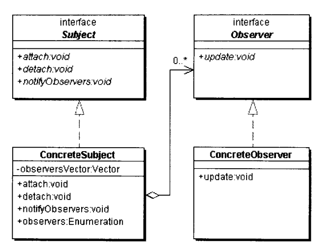  

- 抽象主题（Subject）角色：主题角色把所有对观察者对象的引用抱在一个聚集（比如 Vector 对象）里，每个主题都可以有任何数量的观察者。抽象主题提供一个接口，可以增加和删除观察者对象。
- 抽象观察者（Observer）角色：为所有的具体观察者定义一个接口，在得到主题的通知时更新自己。这个接口叫做更新接口。
- 具体主题（ConcreteSubject）角色：将有关状态存入具体观察者对象；在具体主题的内部状态改变时，给所有登记过的观察者发出通知。具体主题角色又叫做被观察角色（Concrete Observable），通常用一个具体子类实现。
- 具体观察者（ConcreteObserver）角色：存储与主题的状态自恰的状态。具体抽象观察者角色所要求的更新接口，以便使本身的状态与主题的状态相协调。

#### 另一种实现方案

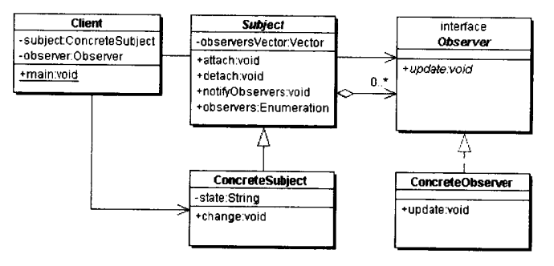  

可以采用抽象类实现抽象主题，将管理聚集的方法交由抽象主题，notifyObserver也可以移到抽象主题中。

#### Java对观察者模式的支持

- java.util.Observer接口
- java.util.Observable类

#### Java中的DEM事件机制

- AWT的DEM（Delegation Event Model）机制
- Servlet技术中的DEM机制
- SAX2技术中的DEM机制

#### 观察者模式的效果

**优点：**  

1. 观察者模式在被观察者和观察者之间建立一个抽象的耦合。
2. 观察者模式支持广播通信。

**缺点：**  

1. 如果一个被观察者对象有很多直接和间接的观察者的话，将所有观察者通知会花费很多时间。
2. 如果被观察者之间有循环依赖的话，被观察者会触发它们之间的循环调用，导致系统崩溃。
3. 如果对象观察者的通知是通过另外的线程进行异步投递的话，系统必须保证投递时以自洽的方式进行的。
4. 虽然观察者模式可以随时是观察者知道所观察的对象发生了变化，但观察者并不知道所观察对象是怎么发生变化的。

#### 与其他模式的关系

备忘录模式、MVC模式

### 第三十九章 专题：观察者模式与AWT中的事件处理

### 第四十章 专题：观察者模式与SAX2浏览器

### 第四十一章 专题：观察者模式与Swing定时器

### 第四十二章 专题：MVC模式与用户输入数据检查

#### 什么是MVC模式

MVC是一种架构模式，可以分解为：

- 合成模式
- 策略模式
- 观察者模式

#### 模式的种类

- 架构模式（Architectural pattern）：一个软件系统里的基本结构组织或纲要。
- 设计模式（Design Pattern）：一种提炼子系统或软件系统中的组件或者它们之间的关系纲要设计。
- 代码模式或成例（Coding Pattern 或 Idiom）：描述了怎样用一个特定的编程语言的特点来实现一个组件的某些特定的方面或关系。

#### MVC模式结构

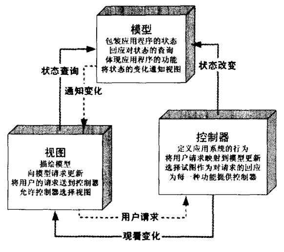  

**模型端**  

模型是执行某些任务的代码，而这部分代码并没有任何逻辑觉得它对客户端的表示方法。

**多个视图端**  

一个模型端可以有几个视图端，而实际上复数的视图端是使用MVC的原始动机。

**多个控制器端**  

当用户端与相应的视图发生交互时，用户可以通过视窗更新模型的状态，这种更新是通过控制端进行的。

### 第四十三章 迭代器模式

迭代器模式又叫游标（Cursor）模式，可以实现顺序地访问一个聚集中的元素而不必暴露聚集的内部表象。

#### 迭代器模式的结构

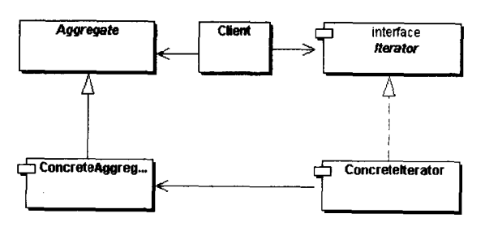  

- 抽象迭代器（Iterator）角色：定义出遍历元素所需的接口。
- 具体迭代器（ConcreteIterator）角色：实现了Iterator接口，并保持迭代过程中的游标位置。
- 聚集（Aggregate）角色：给出创建迭代器对象的接口。
- 具体聚集（ConcreteAggregate)角色：实现了创建迭代器的接口，返回一个具体迭代器实例。
- 客户端（Client）角色：持有对于聚集机器迭代器对象的引用，调用迭代器对象迭代接口，可能操作聚集元素的增加和删除。

#### 迭代器模式的优点和缺点

**优点**  

1. 简化了聚集的界面。
2. 每一个聚集对象都可以有一个或一个以上的迭代器对象，每一个迭代器对象时彼此独立的。
3. 遍历的算法封装在迭代器里面，迭代的算法可以独立于聚集角色变化。

**缺点**  

1. 迭代器给客户端一个聚集被顺序化的错觉。

#### 迭代器模式与其他模式的关系

合成模式、命令模式、备忘录模式、工厂方法模式

### 第四十四章 专题：Java对迭代子模式的支持

### 第四十五章 责任链模式

很多对象由每一个对象及其对下家的引用而连接起来的一条链。请求在这个链上传递，直到这个链上的一个对象决定处理这个请求。发出这个请求的客户端并不知道实际是哪个对象最终处理了这个请求，这使得系统不在影响客户端的情况下动态地组织和分配责任。

#### 责任链模式的结构

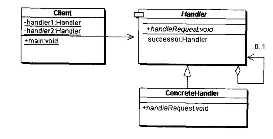  

- 抽象处理者（Handler）角色：定义出一个处理请求的接口。如果需要，接口可以定义出一个方法以设定和返回对下家的引用。
- 具体处理者（ConcreteHandler）角色：具体处理者接到请求后，可以选择将请求处理掉或者传递给下家。由于具体处理者持有下家的引用，因此，如果有需要，处理者可以访问下家。

#### DHTML中的事件处理

浏览器的 DOM 模型中的事件处理均采用责任链模式。

#### 责任链模式与其他模式的关系

合成模式、命令模式、模板方法模式

### 第四十六章 专题：定时器与击鼓传花

### 第四十七章 命令模式

命令模式又称为行动模式或交易模式。它将一个请求或操作封装到一个对象中。命令模式允许系统使用不同的请求把客户端参数化，对请求排队或者记录请求日志，可以提供命令的撤销和恢复功能。

#### 命令模式结构

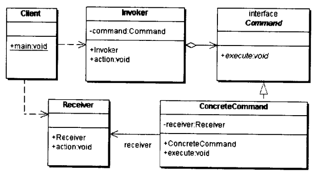  

- 客户（Client）角色：创建一个具体命令对象，并确定其接受者。
- 命令（Command）角色：声明了一个给所有具体命令类的抽象接口。
- 具体命令（ConcreteCommand)角色：定义一个接受者和行为之间的弱耦合；实现execute方法，负责调用接受者的相应操作。
- 请求者（Invoker）角色：负责调用命令对象执行请求，相关的方法叫做行动方法。
- 接受者（Receiver）角色：具体实施和执行一个请求。

#### 什么情况下应当使用命令模式

1. 使用命令模式作为Callback在面向对象系统中的替代。
2. 需要在不同的时间指定请求、将请求排队。
3. 系统支持命令的撤销。
4. 如果一个系统要将系统中所有的数据更新到日志里，以便在系统崩溃时，可以根据日志里读会所有数据更新命令，重新调用execute方法一条一条执行这些命令，从而恢复系统在崩溃前所做的数据更新。
5. 一个系统需要支持事务（transaction）。

#### 使用命令系统的优点和缺点

**优点**  

- 把请求一个操作的对象与知道怎么执行一个操作的对象分割开来。
- 命令类与其他任何别的类一样，可以修改和推广。
- 你可以把命令对象聚合在一起，合成为合成命令。
- 由于加进新的具体命令类不影响其他的类，因此增加新的具体命令类很容易。

**缺点**  

- 使用命令模式会导致某些系统有过多的具体命令类。

#### 命令模式与其他模式的关系

合成模式、备忘录模式、原型模式

### 第四十八章 专题：Swing库中的命令撤销和恢复

### 第四十九章 备忘录模式

又称为快照模式（Snapshot Pattern）或Token模式。备忘录对象是一个用来存储另外一个对象内部状态的快照对象。该模式用意是在不破换封装的条件下，将一个对象的状态捕捉住，并外部化存储起来，从而可以再将来合适的时候吧这个对象还原到存储起来的状态。常常与命令模式和迭代器模式一起使用。

#### 备忘录模式的结构

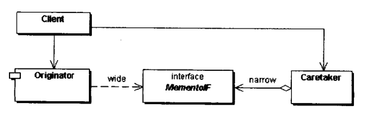  

- 备忘录（Memento）角色
  - 将发起人的内部状态存储起来。发起人通过**宽接口**读取数据，以便恢复发起人对象的内部状态。
  - 保护其内容不被发起人对象之外的任何对象所获取。负责人对象通过**窄接口**获取备忘录对象。
- 发起人（Originator）角色
  - 创建一个含有当前的内部状态的备忘录对象。
  - 使用备忘录对象存储其内部状态。
- 负责人（Caretaker）角色、
  - 负责保存备忘录对象。
  - 不检查备忘录对象的内容。

#### “白箱”备忘录模式的实现

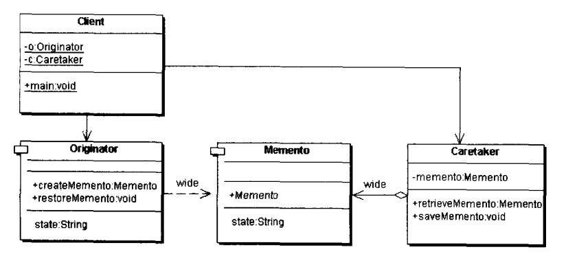

#### 双重接口及其在Java语言中的实现

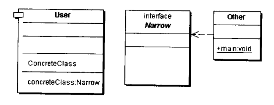

#### “黑箱”备忘录模式的实现

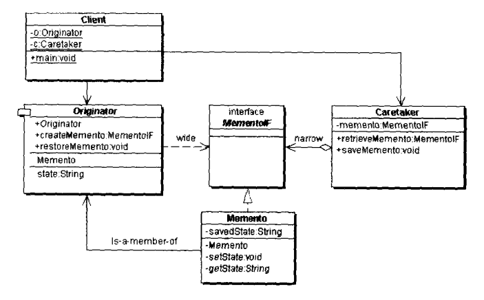

#### 备忘录模式与多重检查点

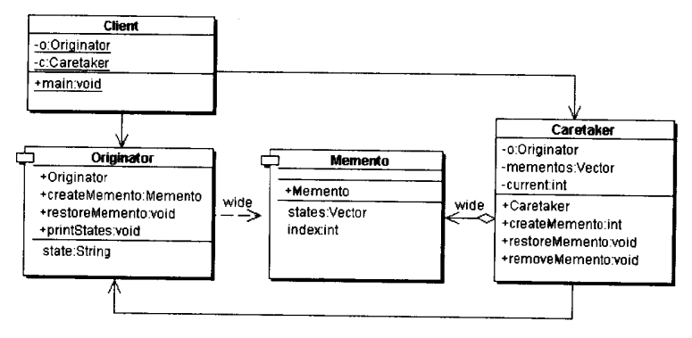

#### “自述历史”模式

#### “假如”协议模式

#### 备忘录模式与其他模式

命令模式、原始模型模式、迭代子模式

#### 备忘录模式的应用

- JDBC与数据库
- J2EE框架中备忘录模式的应用（Session）
- 浏览器的Cookie文件
- 系统配置文件

#### 备忘录模式的优缺点

**优点**  

- 有时一些发起人对象的内部信息必须保存在发起人以外的地方，但是必须要有发起人对象自己去取。
- 本模式简化了发起人类。
- 当发起人角色的状态改变的时候，有可能这个状态无效，这是就可以用存储起来的备忘录将状态复原。

**缺点**  

- 如果发起人角色的状态需要完整地存储到备忘录对象中，那么在资源消耗上面备忘录对象会很昂贵。
- 当负责人角色将一个备忘录角色存储起来的时候，负责人可能并不知道这个状态会占用多大的存储空间，从而无法提醒用户一个操作是否很昂贵。
- 当发起人角色状态改变的时候，有可能这个状态无效。

### 第五十章 状态模式

允许一个对象在其内部状态改变的时候改变其行为。这个对象看上去就像是改变了的其他类一样。

#### 状态模式结构

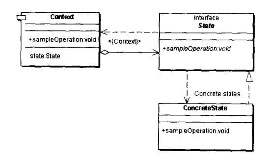  

- 抽象状态（State）角色：定义一个接口，用以封装环境（Context）对象的一个特定的状态所对应的行为。
- 具体状态（ConcreteState）角色：每一个具体状态类都实现了环境（Context）的一个状态所对应的行为。
- 环境（Context）角色：定义客户端所感兴趣的接口，并且保留一个具体状态类的实例。这个具体状态类的实例给出此环境对象的现有状态。

#### 状态模式的效果

1. 状态模式需要对每一个系统可能取得的状态创立一个状态类（State）的子类。
2. 由于每一个状态都被包装到了类里面，就可以不必采用过程性的处理方式。
3. 使用状态模式使系统的状态变化变得很明显。
4. 可以在系统的不同部分使用相同的一些状态类的对象。
5. 状态模式的缺点是会造成大量的小的状态类；优点是使程序免于大量的条件转移语句，使程序实际上更易维护。
6. 系统所选择的状态子类均是从一个抽象的状态类或接口继承而来，Java语言的特性使得Java实现的状态模式较为安全。

#### 什么情况下使用状态模式

1. 一个对象的行为依赖于它所处的状态。
2. 对象在某个方法里依赖于一重或多重的条件转移语句，其中含有大量的代码。

#### 状态模式与策略模式的区别

区分状态模式和策略模式的简单方法是考察环境角色是否有明显的状态和状态的过度。

- 如果环境角色只有一个状态，那么就应当使用策略模式。策略模式的特点是：一旦环境角色选择了一个具体的策略类，那么在状态环境类的生命周期里它都不会改变这个具体策略类。
- 另一种情况，机环境角色有明显的状态转移。在环境类的生命周期里面，会有几个不同的状态被调用。

策略模式所选的策略往往并不明显地告诉客户端，而状态模式则相反，环境角色所处的状态是明显告诉客户端的。

### 第五十一章 专题：崂山道士与状态模式

### 第五十二章 专题：单分派和多分派

#### 分派的概念

变量被声明时的类型叫做变量的**静态类型（Static Type）**，有些作者又把静态类型叫做**明显类型（Apparent Type）**；而变量所应用的对象对真实类型又叫做变量的**实际类型（Actual Type）**。

这种根据对象的类型而对方法进行的选择，就是**分派（Dispatch）**。根据分派发生的时期，可以将分派分为两种，即静态分派和动态分派。

**静态分派（Static Dispatch）**发生在编译时期，分派根据静态类型信息发生。方法重载（Overloading）就是静态分派。

**动态分派（Dynamic Dispatch）**发生在运行时期，动态分派动态地置换掉某个方法。方法重写（Overriding）就是动态分派。

#### 分配的类型

一个方法所属的对象叫做方法的接收者，方法的接收者与方法的参量统称做方法的**宗量**。

根据分派可以基于多少种宗量，可以将面向对象的语言划分为**单分派（Uni-Dispatch）语言**和**多分派语言（Multi-Dispatch）**。单分派语言根据一个宗量的类型进行对方法的选择，多分派语言根据多于一个宗量的类型对象方法进行选择。

C++和Java均是动态的单分派语言，因为这两种语言的动态分派仅仅会考虑到方法的接收类型。同时又是静态的多分派语言，因为这两种语言对重载方法分派会考虑到方法的接收者的类型以及方法的所有参量的类型。

#### 双重分派

Java语言不支持动态的多分派，也就意味着Java不支持动态的双分派。但是通过设计模式，也可以在Java语言里实现动态的双分派。

##### 方案一：类型判断

例子：java.awt.Component的源码

##### 方案二：“返传球”

仅仅是返传了一下球，并不能解决双重分派的问题。关键是怎样利用者两次调用，以及Java语言的动态单分派功能，使得在这种传球的过程中，能够触发两次（动态）单分派。

其实这种返传球就是访问者模式的精华。

### 第五十三章 访问者模式

访问者模式是对象的行为模式。访问者模式的目的是封装一些施加于某种数据结构元素之上的操作。一旦这些操作需要修改的话，接受这个操作的数据结构则可以保持不变。

访问者模式适用于数据结构相对未定的系统，它把数据结构和作用于结构上的操作之间的耦合解脱开，使得操作集合可以相对自由地演化。

#### 访问者模式的结构

这个静态图显示了有两个具体访问者和两个具体节点的访问者模式的设计，必须指出的是，具体访问者的数目与具体节点的数目没有任何关系，虽然这个示意性的系统里面两者的数目都是两个。

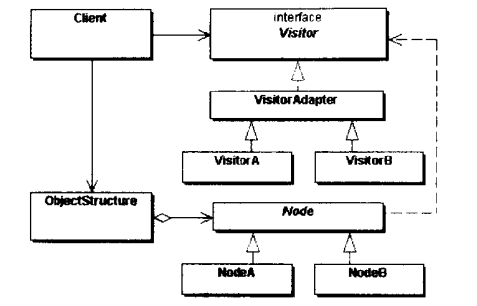  

- 抽象访问者（Visitor）角色：声明了一个或者多个访问操作，形成所有的具体元素角色必须实现的接口。
- 具体访问者（ConcreteVisitor）角色：实现抽象访问者角色所声明的接口。
- 抽象节点（Node）角色：声明一个接受操作，接受一个访问者对象作为一个参量。
- 具体节点（Node）角色：实现了抽象元素所规定的操作。
- 结构对象（ObjectStructure）角色：有如下的一些责任，可以遍历结构中的所有元素；如果需要，提供一个高层次的接口让访问者对象可以访问每一个元素；如果需要，可以设计成一个复合对象或者一个聚集，如List或Set。

#### 使用访问者模式的优点和缺点

**优点：**  

1. 访问者模式使得增加新的操作变得很容易。
2. 访问者模式将有关行为集中到一个访问者对象中，而不是分散到一个个的节点类中。
3. 访问者模式可以跨过几个类的等级结构访问属于不同的等级结构的成员类。
4. 访问者对象可以积累状态。

**缺点：**  

1. 增加一个新的节点类变得很困难。
2. 破环封装。由于显然的缺点，访问者成为一个有争议的设计模式。

#### 访问者模式的实现

- 对节点的优化
- 谁负责遍历行为
- 是否需要结构对象角色
- 是否需要抽象访问者角色
- 访问者模式与缺省适配模式的联合使用

#### 与访问者模式有关的模式

迭代模式、合成模式、解释器模式

### 第五十四章 解释器模式

给定一个语言后，解释器可以定义出其文法的一种表示，并同时提供一个解释器。客户端可以使用这个解释器来解释这个语言中的句子。

#### 解释器模式的结构

- 抽象表达式（Expression）角色：声明一个所有具体表达式都需要实现的抽象接口。这个接口提供了interpret方法，称作解释操作。
- 终结表达式（Terminal Expression）角色：这是一个具体角色，实现了抽象表达式的接口，每一个终结符都有一个具体的终结表达式与其对应。
- 非终结表达式（Nonterminal Expression）角色：这是一个具体角色。文法中的每一条规则都需要一个非终结表达式类；每一个表达式右侧的符号都持有一个静态类型为Expression的实例变量；实现解释操作，即interpret方法，以递归方式调用表达式右侧符号的实例变量。
- 客户端（Client）角色：代表模式的客户端有如下功能：建造一个抽象语法树；调用解释操作。
- 环境（Context）角色（一般情况下需要）：提供解释器之外的一些全局信息，比如变量的真实值。

#### 用途

- 系统有一个简单的语言可供解释
- 一些重复发生问题可以用这种简单的语言表达
- 效率不是主要的考虑

#### 相关模式

合成模式、不变模式和享元模式、迭代器模式、访问者模式、状态模式

### 第五十五章 调停者模式

调停者模式包装了一系列对象相互作用的方式，使这些对象不必互相明显应用。从而使他们松散地耦合。当这些对象某些对象之间相互作用发生改变时，不会影响到其他的对象之间的相互应用。从而保证这些互相作用可以彼此独立的变化。

在调停者模式中，所有的成员对象都可以协调工作，但是又不直接参与管理。这些对象都是与一个处于中心地位的协调者发生紧密的关系，由这个协调者对象进行协调工作。这个协调者对象叫做调停者（Mediator），而调停者所协调的成员称作同事（Colleage）对象。在Colleage对象内部发生的时期不是直接传到其他对象上的。若加入一个对象，相互引用的关系将不再是以指数的形式增加，只需要调停者对象做修改即可，删除一个对象同理。

#### 调停者模式的结构

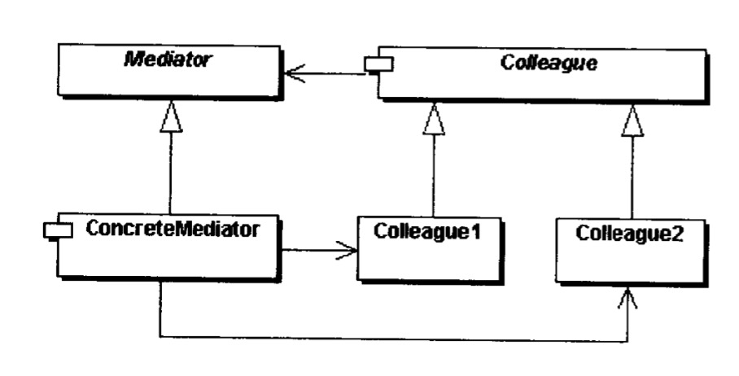

调停者模式包括以下几个对象：

- 抽象调停对象角色：定义同事对象到调停者对象的接口，其中主要的方法是一个（或多个）事件方法。
- 具体调停者对象角色：实现抽象调停者所声明的事件方法。知晓所有其他同事类，它从具体的同事类接收信息、向具体同事类发出命令。
- 抽象同事角色：定义调停者到同事的接口。同事对象只知道调停者，而不知道其他同事对象。
- 具体同事类角色：实现了抽象同事类的接口。

#### 优点和缺点

优点：

- 较少地使用静态的继承关系，使得具体同事类更加容易被复用。
- 适当使用可以避免同事间的过度耦合，使得调停类与同事类可以相对独立地演化。
- 将相互作用变为一对多，使对象关系更容易理解。
- 将对象的行为和协作抽象化，把对象在小尺度上的行为与其他对象的相互作用分开处理。

缺点：

- 降低同事对象的负责性的同时增加了调停者对象的复杂性。
- 调停者类的代码无法复用。

显然调停者模式为同事对象，而非调停者对象提供了可扩展性，所以这个模式提供的可扩展性是一种（向同事对象）倾斜的可扩展性。

#### 相关模式

门面模式、观察者模式、适配器模式

